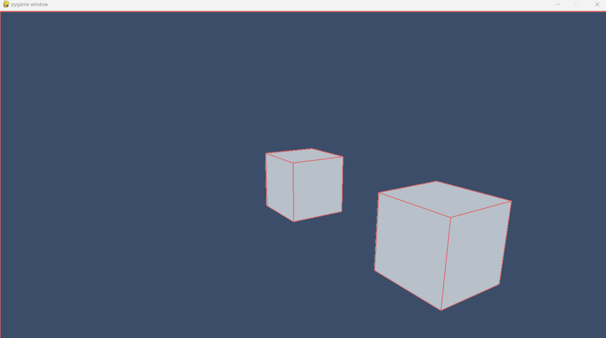
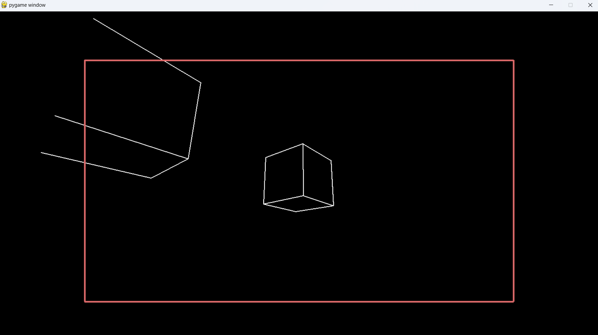

# Python-3D

## About
This project is an experimental 3D renderer created with python that runs on CPU.

Before running the program, you should install the following dependencies :
- pygame (`pip install pygame`)
- numpy (`pip install numpy`)
- for the stl version only : numpy-stl (`pip install numpy-stl`)

Then run `main.py` :
```shell
python main.py
```


## Screenshots





